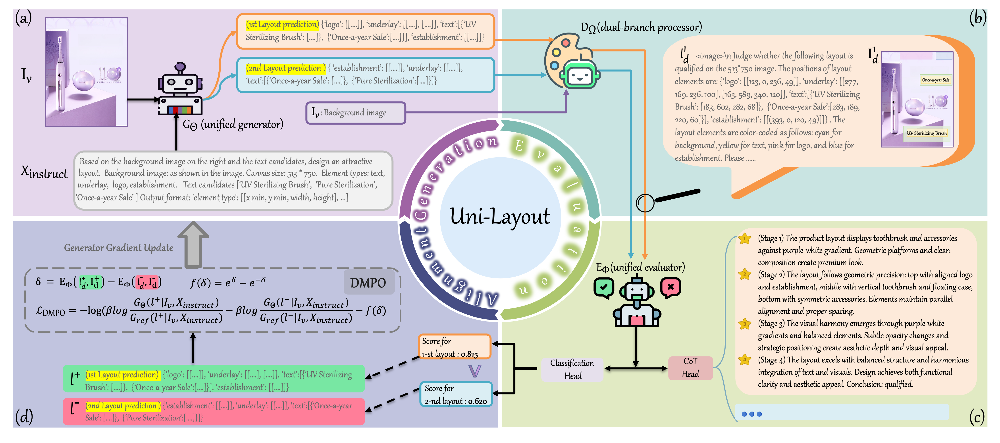

# Uni-Layout
## Uni-Layout: Integrating Human Feedback in Unified Layout Generation and Evaluation
[ACM MM 2025] Official PyTorch Code for "Uni-Layout: Integrating Human Feedback in Unified Layout Generation and Evaluation"

## Abstract
Layout generation plays a crucial role in enhancing both user experience and design efficiency. However, current approaches suffer from task-specific generation capabilities and perceptually misaligned evaluation metrics, leading to limited applicability and ineffective measurement. In this paper, we propose \textit{Uni-Layout}, a novel framework that achieves unified generation, human-mimicking evaluation and alignment between the two. For universal generation, we incorporate various layout tasks into a single taxonomy and develop a unified generator that handles background or element contents constrained tasks via natural language prompts. To introduce human feedback for the effective evaluation of layouts, we build \textit{Layout-HF100k}, the first large-scale human feedback dataset with 100,000 expertly annotated layouts. Based on \textit{Layout-HF100k}, we introduce a human-mimicking evaluator that integrates visual and geometric information, employing a Chain-of-Thought mechanism to conduct qualitative assessments alongside a confidence estimation module to yield quantitative measurements. For better alignment between the generator and the evaluator, we integrate them into a cohesive system by adopting Dynamic-Margin Preference Optimization (DMPO), which dynamically adjusts margins based on preference strength to better align with human judgments. Extensive experiments show that \textit{Uni-Layout} significantly outperforms both task-specific and general-purpose methods.   

 

## 📢 News

`[2025-09-02]:` 🚀 CoT data has been released! You can now find it in the ["Dataset for Reward Model" link](https://drive.google.com/drive/folders/1VASp90_mqSwJxJH65v5-iP9Sk3tgr23M?usp=drive_link).

`[2025-08-04]:` 🎯 Our paper is now available on arXiv! Check it out here: [https://arxiv.org/abs/2508.02374](https://arxiv.org/abs/2508.02374).

`[2025-07-04]:` 🎉 Exciting news! Our paper has been accepted to ACM MM 2025! Stay tuned for more updates!

## 🚀 Code & Weights Notice
The implementation code and pre-trained weights are currently undergoing JD Open-Source Review Process. We are committed to open-sourcing all materials to support research reproducibility.

- Reward Model Checkpoints: [Download Link](https://drive.google.com/drive/folders/1evrHmorHW7CBLRhxrV3-3qvFki1ovoJ3?usp=drive_link)

## 📊 Datasets
### 1. Dataset for Generation Model
[Download Link](https://drive.google.com/drive/folders/1OLWRUZSiecpGuG2sUdQHOnmp46P9ojuD?usp=sharing).

#### Key Fields
- **`sku_id`**: Anonymized sample identifier.
- **`image`**: Path to the image (optional; may be absent for text-only tasks).
- **`conversations`**: List of two messages:
  - **human**: Task description, may include the `<image>` placeholder, canvas size, element types, and layout constraints.
  - **gpt**: Layout result; `value` is a string in the form `Layout:{...}`, where bounding boxes are `[x_min, y_min, width, height]`.

### 2. Dataset for Reward Model
[Download Link](https://drive.google.com/drive/folders/1VASp90_mqSwJxJH65v5-iP9Sk3tgr23M?usp=drive_link).

#### Key Fields
- **`image`**: Path to the image.
- **`conversations`**: Single-turn QA pair:
  - **human**: Evaluation instruction with candidate layout and constraints; expects a binary decision (0/1).
  - **gpt**: The answer; `value` is the Ground Truth label (0 or 1).

## 📧 Contact for Urgent Requests
If you require early access for research collaboration or encounter urgent issues, please contact: [shuolucs@gmail.com](mailto:shuolucs@gmail.com)

# Copyright & Licensing
© JD.COM. All rights reserved. The datasets and software provided in this repository are licensed exclusively for academic research purposes. Commercial use, reproduction, or distribution requires express written permission from JD.COM. Unauthorized commercial use constitutes a violation of these terms and is strictly prohibited.
