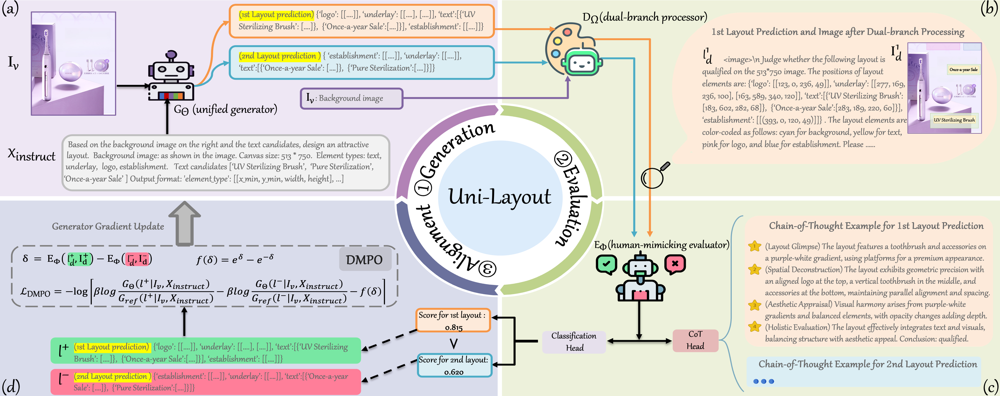

# Uni-Layout
## Uni-Layout: Integrating Human Feedback in Unified Layout Generation and Evaluation
[ACM MM 2025] Official PyTorch Code for "Uni-Layout: Integrating Human Feedback in Unified Layout Generation and Evaluation"

## Abstract
Layout generation plays a crucial role in enhancing both user experience and design efficiency. However, current approaches suffer from task-specific generation capabilities and perceptually misaligned evaluation metrics, leading to limited applicability and ineffective measurement. In this paper, we propose \textit{Uni-Layout}, a novel framework that achieves unified generation, human-mimicking evaluation and alignment between the two. For universal generation, we incorporate various layout tasks into a single taxonomy and develop a unified generator that handles background or element contents constrained tasks via natural language prompts. To introduce human feedback for the effective evaluation of layouts, we build \textit{Layout-HF100k}, the first large-scale human feedback dataset with 100,000 expertly annotated layouts. Based on \textit{Layout-HF100k}, we introduce a human-mimicking evaluator that integrates visual and geometric information, employing a Chain-of-Thought mechanism to conduct qualitative assessments alongside a confidence estimation module to yield quantitative measurements. For better alignment between the generator and the evaluator, we integrate them into a cohesive system by adopting Dynamic-Margin Preference Optimization (DMPO), which dynamically adjusts margins based on preference strength to better align with human judgments. Extensive experiments show that \textit{Uni-Layout} significantly outperforms both task-specific and general-purpose methods.   

 

## 📢 News

`[2025-08-04]:` 🎯 Our paper is now available on arXiv! Check it out here: [https://arxiv.org/abs/2508.02374](https://arxiv.org/abs/2508.02374).

`[2025-07-04]:` 🎉 Exciting news! Our paper has been accepted to ACM MM 2025! Stay tuned for more updates!

## 🚀 Code & Weights Notice
The implementation code and pre-trained weights are currently undergoing JD Open-Source Review Process. We are committed to open-sourcing all materials to support research reproducibility.

## 📊 Datasets
### 1. Dataset for Generation Model
[Download Link](https://drive.google.com/drive/folders/1OLWRUZSiecpGuG2sUdQHOnmp46P9ojuD?usp=sharing).

### 2. Dataset for Reward Model
[Download Link](https://drive.google.com/drive/folders/1VASp90_mqSwJxJH65v5-iP9Sk3tgr23M?usp=drive_link).

## 📧 Contact for Urgent Requests
If you require early access for research collaboration or encounter urgent issues, please contact: [shuolucs@gmail.com](mailto:shuolucs@gmail.com)
